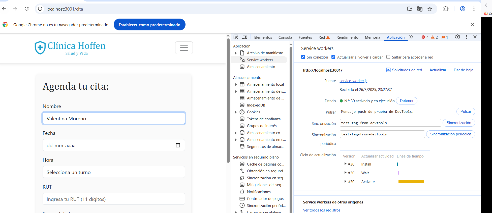

## INSTALACIÓN

<code>
git clone git@github.com:vpmlagos/m6-laboratorio-2.git 
npm install 
npm install react-router-dom 
npm install prop-types 
npm install bootstrap 
npm install bootstrap @popperjs/core 
npm install react-bootstrap-icons 
npm run dev 
</code>

## Configuración de LocalStorage o SessionStorage

### Premisa

- Almacena datos de usuario o información importante para que persista incluso
después de recargar la página.
- Asegúrate de que el almacenamiento se realice de manera eficiente y que los
datos almacenados puedan ser recuperados correctamente.

#### Implementación

Aplicado a la agenda de horas, la información guardada en la página de citas se queda aún al recargar la página
<code>

 const [formData, setFormData] = useState(() => {
    const savedData = sessionStorage.getItem('formData');
    return savedData ? JSON.parse(savedData) : initialFormState;
  });

  const [error, setError] = useState('');
  const nameInputRef = useRef(null);

  useEffect(() => {
    if (nameInputRef.current) {
      nameInputRef.current.focus();
    }
  }, []);

  useEffect(() => {
    sessionStorage.setItem('formData', JSON.stringify(formData));
  }, [formData]);

</code>

## Implementación de IndexedDB

- Almacena en IndexedDB datos relevantes como información de citas, doctores
o pacientes del hospital.
- Asegúrate de que los datos sean almacenados y recuperados correctamente de
IndexedDB.

### Implementación

<code>

function saveToIndexedDB(request, response) {
  const openRequest = indexedDB.open("hospitalDB", 1);

  openRequest.onupgradeneeded = (e) => {
    const db = e.target.result;
    if (!db.objectStoreNames.contains("dynamicData")) {
      db.createObjectStore("dynamicData", { keyPath: "url" });
    }
  };

  openRequest.onsuccess = (e) => {
    const db = e.target.result;
    const transaction = db.transaction("dynamicData", "readwrite");
    const store = transaction.objectStore("dynamicData");
    store.put({ url: request.url, data: response });
  };

  openRequest.onerror = (e) => {
    console.error("Error al abrir IndexedDB", e);
  };
}
</code>

## Despliegue y configuración del Service Worker Personalizado

- Personaliza y despliega un Service Worker que gestione los archivos de caché y
soporte el almacenamiento offline:
- Asegúrate de que el Service Worker funcione adecuadamente para manejar la
caché de los archivos y el almacenamiento en LocalStorage o IndexedDB.
- Verifica que la PWA esté desplegada correctamente y sea accesible offline.

## Pruebas con Lighthouse

- Ejecuta Lighthouse para validar el rendimiento de la PWA:
- Verifica que la aplicación sea instalable, funcione offline, y tenga un buen
rendimiento en términos de velocidad y accesibilidad.
- Revisa el informe de Lighthouse y mejora los aspectos recomendados por la
herramienta.